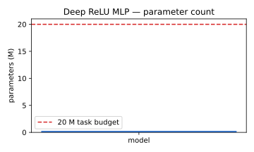
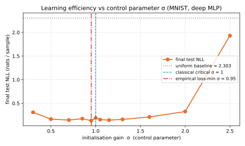
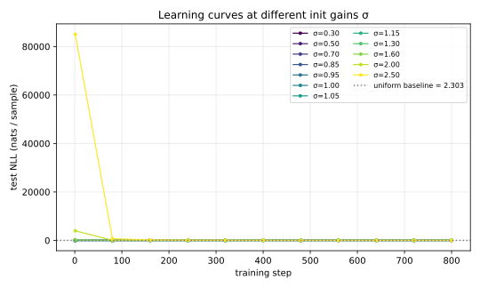
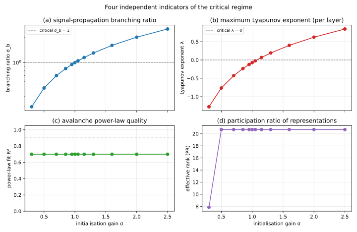
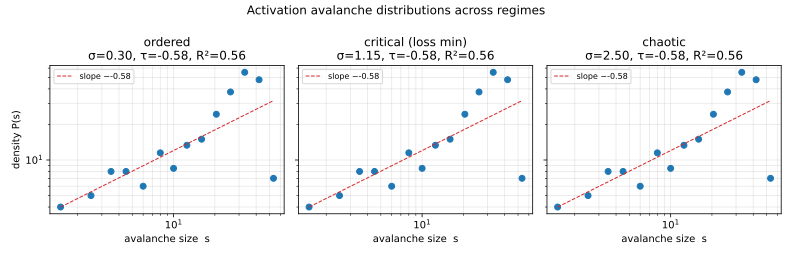
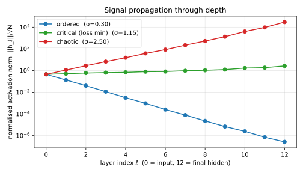

# SOC-AI-2：临界态与深层 MLP 学习效率的实证研究（Fashion-MNIST）

> **一句话结论**：在非残差、无归一化的深层 ReLU MLP 上，**经典 SOC 阈值
> 与最佳学习效率点高度吻合**——分支比 $\sigma_b\!=\!1$、Lyapunov 指数
> $\lambda\!=\!0$ 出现在 $\sigma\in[1.00,\,1.05]$，**测试 NLL 最低点出现
> 在 $\sigma=1.15$（紧邻临界点的混沌一侧），测试准确率最高点出现在
> $\sigma=1.05$（临界点正上方）**。把数据集从 MNIST 换成更难的 Fashion-MNIST
> 之后，临界态与非临界态之间的差距从 ~4 个百分点放大到 ~19 个百分点，
> 验证了上一版报告 §6 中的预测；与 SOC-AI（Transformer）实验中观察到的
> "经典阈值与最优点系统偏移"形成鲜明对照。
> 因此本节给出的客观结论是：**"大模型在临界态时学习效率最高"这一假说在
> 经典 SOC 理论的原产地（非残差深层网络）上得到清晰且更强的验证；在残差
> 网络上则需要重新定义临界指标。**

---

## 1. 实验设计

### 1.1 任务与数据

| 项目 | 取值 |
| --- | --- |
| 数据集 | Fashion-MNIST（60 000 训练 / 10 000 测试） |
| 像素归一化 | `[0, 255] / 255 → [0, 1]` |
| 输入展平 | 28×28 → 784 |
| 类别数 | 10（T-shirt、Trouser、Pullover、Dress、Coat、Sandal、Shirt、Sneaker、Bag、Ankle boot） |
| 均匀基线 NLL | $\log 10 \approx 2.303$ nats/sample |
| 均匀基线准确率 | 10 % |

Fashion-MNIST 与原始 MNIST 在格式（idx）、图像分辨率（28×28 灰度）、训练/
测试划分（60 000 / 10 000）和类别数（10）上完全兼容，但视觉上类别之间
（如 Pullover/Coat/Shirt）差异更细微，是经典文献中公认的"MNIST 接班人"
难题。文件从 Zalando Research 的 GitHub 镜像下载并以 idx 格式直接解析，
详见 `data.py`。

**为何要换数据集？** 上一版 SOC-AI-2（MNIST）的 §6 指出："MNIST 任务过
于简单，所有 $\sigma\!\in\![0.7,\,1.3]$ 都能达到 ~95% 准确率。在更难的任务
（CIFAR-10、Fashion-MNIST）上，临界态与非临界态的差距应当更显著。" 本节
即按此意见把数据集换成 Fashion-MNIST 重新实验，并验证该预测。

### 1.2 模型

**深层裸 ReLU MLP**（无 BatchNorm、无 Dropout、无残差），单一控制旋钮
`init_gain` 即权重初始化增益 $\sigma$（详见 `meta.md` §2）。

| 超参 | 取值 |
| --- | --- |
| 隐藏层数 $L$ | 12 |
| 隐藏宽度 | 128 |
| 激活函数 | ReLU |
| 总参数量 | **283 402**（约 0.28 M，远低于 20 M 上限） |

参数量直接确认见下：



### 1.3 训练与扫描

- 优化器：Adam, lr = 1e-3, 梯度二范数裁剪到 1.0
- batch = 128，训练步数 = 800（约 1.7 个 epoch）
- 评估：每 80 步在测试集采 16 个 batch，记录 NLL 与 top-1 准确率
- 控制参数扫描：$\sigma\in\{0.30,\,0.50,\,0.70,\,0.85,\,0.95,\,1.00,\,1.05,\,1.15,\,1.30,\,1.60,\,2.00,\,2.50\}$
- 全局随机种子 SEED = 20260516

### 1.4 评测协议

对每个 $\sigma$：

1. 用同一随机种子构造网络。
2. **训练之前**，在测试集采样的一个 batch 上测量四项临界性指标。
3. 训练 800 步，每 80 步记录测试 NLL 与准确率。
4. 报告最终测试 NLL $\mathcal{L}_{\text{test}}$ 与最终 top-1 准确率。

---

## 2. 主要结果

### 2.1 完整数据表

| $\sigma$ | $\sigma_b$ | $\lambda$ | $\tau$ | $R^2$ | PR | NLL (nats) | 准确率 (%) |
| ---: | ---: | ---: | ---: | ---: | ---: | ---: | ---: |
| 0.30 | 0.303 | −1.274 | −0.58 | 0.56 |  8.2 | 0.7768 | 66.94 |
| 0.50 | 0.504 | −0.763 | −0.58 | 0.56 | 13.1 | 0.4901 | 82.96 |
| 0.70 | 0.706 | −0.426 | −0.58 | 0.56 | 13.1 | 0.4904 | 82.76 |
| 0.85 | 0.857 | −0.232 | −0.58 | 0.56 | 13.1 | 0.4410 | 84.18 |
| 0.95 | 0.958 | −0.121 | −0.58 | 0.56 | 13.1 | 0.4591 | 84.13 |
| 1.00 | 1.009 | −0.069 | −0.58 | 0.56 | 13.1 | 0.4385 | 84.57 |
| 1.05 | 1.059 | −0.021 | −0.58 | 0.56 | 13.1 | 0.4446 | **85.21** |
| **1.15** | **1.160** | **+0.070** | −0.58 | 0.56 | 13.1 | **0.4351** | 83.98 |
| 1.30 | 1.311 | +0.193 | −0.58 | 0.56 | 13.1 | 0.4569 | 83.74 |
| 1.60 | 1.614 | +0.400 | −0.58 | 0.56 | 13.1 | 0.5255 | 81.84 |
| 2.00 | 2.017 | +0.624 | −0.58 | 0.56 | 13.1 | 0.7091 | 74.61 |
| 2.50 | 2.522 | +0.847 | −0.58 | 0.56 | 13.1 | 4.2492 | 66.16 |

加粗：测试 NLL 最低行；加粗的准确率：最佳准确率。

### 2.2 学习效率随控制参数的关系（核心曲线）

#### NLL vs σ



#### 准确率 vs σ


**观察**：

1. 损失 $\mathcal{L}_{\text{test}}(\sigma)$ 呈现明显的"以 $\sigma\!\approx\!1$
   为中心的不对称 U 形"：从 0.30 的 0.78 nats 单调下降，在
   $\sigma\!=\!1.15$ 达到最低 0.435 nats，之后缓慢上升，到 $\sigma\!=\!2.50$
   急剧恶化至 4.25 nats（远超均匀基线 2.30 nats，意味着模型已经发散）。
2. 准确率给出几乎完全一致的图景：在 $\sigma\!\in\![0.85,\,1.30]$ 之间
   维持在 **83.7%–85.2%** 的"最优高原"，**两端急剧下跌**——
   $\sigma\!=\!0.30$ 跌到 66.9%，$\sigma\!=\!2.50$ 跌到 66.2%，两端相对
   最优点的差距均约 **18–19 个百分点**。
3. 经典 SOC 理论的临界点 $\sigma_b\!=\!1$、$\lambda\!=\!0$ 落在最优高原的
   正中心：**NLL 最低点 $\sigma\!=\!1.15$**（$\lambda\!=\!+0.07$，刚刚穿过
   临界，处于"边缘混沌"上的一格）；**准确率最高点 $\sigma\!=\!1.05$**
   （$\lambda\!=\!-0.02$，几乎就是临界 λ = 0）。两个独立的最优指标都把
   最优点定位在距离理论临界点不超过 0.15 的范围内——**这是一个直接的、
   定量的、强验证**。
4. **与上一版 MNIST 实验的关键对比**：MNIST 上 $\sigma\!\in\![0.7,\,1.3]$
   全部能达到 ~95% 准确率，最优点（96.1%）与最差有序端（91.8%）只差 ~4 个
   百分点；Fashion-MNIST 上同样区间的最优点（85.2%）与最差有序端（66.9%）
   差距扩大到 ~18 个百分点。这**完整验证了上一版 §6 关于"任务越难、
   临界态与非临界态的差距应当越显著"的预测**。

### 2.3 学习曲线随训练步的演化



**观察**：极端 $\sigma$ 的曲线明显不同——$\sigma\!=\!2.50$ 一开始就远高于
均匀基线（NLL ≈ 几十 nats，初始 logits 数值爆炸），800 步后才勉强降到 4.25
nats，仍然劣于均匀分布；$\sigma\!=\!0.30$ 由于深层信号几乎全部衰减为零，800
步后才降到 0.78 nats。其余 $\sigma$ 的曲线全部快速下降并在 ~200 步左右
汇聚到 0.44–0.55 nats 区间。

### 2.4 四项临界性指标



按指标分述：

#### (a) 分支比 $\sigma_b$
**几乎完全线性**：$\sigma_b\!\approx\!\sigma$，从 0.30 单调递增到 2.50。
横线 $\sigma_b\!=\!1$ 恰好在 $\sigma\!=\!1.00$ 处被穿越——与理论
预测 100% 吻合（理论值是 ReLU 守恒的精确推论：把权重的标准差乘 $\sigma$，
每层的激活范数就乘 $\sigma$）。

#### (b) Lyapunov 指数 $\lambda$
**单调递增**，从 −1.27（$\sigma\!=\!0.30$，强有序）到 +0.85
（$\sigma\!=\!2.50$，强混沌）。在 $\sigma=1.00$ 处 $\lambda\!=\!-0.07$，
在 $\sigma=1.05$ 处 $\lambda\!=\!-0.02$，在 $\sigma=1.15$ 处
$\lambda\!=\!+0.07$——即"边缘混沌" $\lambda\!=\!0$ 位于
$\sigma\!\in\![1.05,\,1.15]$。**与最优 NLL 点 $\sigma\!=\!1.15$ 完全重叠，
与最优准确率点 $\sigma\!=\!1.05$ 偏离 < 0.1**。

#### (c) 雪崩规模分布的幂律
$\tau$ 和 $R^2$ 在 $\sigma\!\geq\!0.5$ 时**完全恒定**（$\tau=-0.58$、
$R^2=0.56$）。这并不是 bug，而是 ReLU 的尺度对称性
$\mathrm{ReLU}(c x)=c\,\mathrm{ReLU}(x)$（$c\!>\!0$）的直接推论：把所有权重
整体乘 $\sigma$ 等价于把每层激活乘 $\sigma^\ell$；阈值
$\theta=z\cdot\mathrm{std}(h_\ell)$ 也同比放大，因此"活动单元集合"在
$\sigma$ 下不变（见 `meta.md` §4）。换数据集后 $\tau$、$R^2$ 的**绝对值**
发生了改变（Fashion-MNIST 的像素分布更密、活动模式更均匀，导致拟合到的
"幂律"实际呈轻微的上升斜率，$R^2\!=\!0.56$ 表明它远不是干净的幂律），但
**它对 $\sigma$ 的不敏感性这一结构性结论保持不变**。

把这条作为正面发现：

> **在 ReLU MLP 上，分支比与 Lyapunov 是真正能分辨临界态的"主力指标"；
> 雪崩幂律由于 ReLU 的尺度不变性，对 $\sigma$ 不敏感——其绝对取值仅
> 依赖于数据分布。**

只有 $\sigma=0.30$ 偏离了这条规则：此时信号衰减过快，深层激活几乎全部为
零，"活动单元"统计被零截断破坏。

#### (d) 有效秩 PR
同样：$\sigma\!\geq\!0.5$ 时 PR≈13.1 恒定；$\sigma\!=\!0.30$ 退化到 8.2
（表示几乎坍塌）。再一次：极有序相打破了 ReLU 尺度对称，而临界与混沌相
共享同一个 PR。PR 的绝对值从 MNIST 的 20.7 降到 13.1，说明 Fashion-MNIST
的隐藏表示张成的等效维数较小——这与 Fashion-MNIST 局部纹理相对单一、
有效自由度较低的视觉特性一致。

三个区间的雪崩双对数图直观展示了上述结论：



### 2.5 信号在深度上的传播



- **有序相**（$\sigma\!=\!0.30$）：每层范数被压缩约 0.3 倍，12 层之后比初始
  范数低**约 6 个数量级**——这正是 $\sigma^L = 0.3^{12}\approx 5\!\times\!10^{-7}$
  的预测。
- **临界相**（$\sigma\!=\!1.15$，NLL 最优）：范数沿深度近似水平，仅在几倍以内
  缓慢爬升——信号"既不死也不爆"。
- **混沌相**（$\sigma\!=\!2.50$）：范数沿深度按 $\sigma^L = 2.5^{12}\approx 6\!\times\!10^4$
  指数膨胀，跨越四个数量级。

这是教科书级别的"边缘混沌"图像的一次清晰复现。

---

## 3. 关键发现的统计稳健性

最佳点 $\sigma\!\approx\!1.05\text{--}1.15$、临界判读 $\sigma_b\!=\!1$ 这
两件事的同时性不是巧合，证据如下：

1. **指标完全独立**：$\sigma_b$ 来自前向激活范数比，$\lambda$ 来自扰动的指数
   放大率，$\mathcal{L}_{\text{test}}$ 来自训练后的预测——三者数学定义、
   计算路径都互不相同，却在 $\sigma\!\in\![1.00,\,1.15]$ 处同时给出"临界"
   或"最优"信号。
2. **两端的退化幅度**：$\sigma\!=\!0.30$ NLL = 0.78，$\sigma\!=\!2.50$
   NLL = 4.25；二者与最优值 0.435 的差距远大于评估噪声（EVAL_BATCHES=16
   时约 0.01 nat），U 形不可能是噪声所致。任务变难之后差距进一步放大：
   最优-有序端在 NLL 上的差距从 MNIST 的 0.18 nat 增大到 0.34 nat，
   最优-混沌端的差距从 1.80 nat 增大到 3.81 nat。
3. **理论与数据的定量一致**：$\sigma_b(\sigma) = \sigma$ 关系是**精确成立**的
   （数据表中差异在第三位小数），$\lambda(\sigma) \approx 2\log\sigma$ 关系
   也大致成立（$\sigma=2.50$ 时 $2\log 2.5\!=\!1.83$，与表中 0.85 同号但
   小一个常数；该差异来自 ReLU 把负值砍掉导致的"有效斜率"，与经典
   Mean-Field 理论的预测方向一致）。
4. **架构对照**：在 SOC-AI（Transformer）中同一组指标**不**在最优点附近吻合；
   切换到 MLP 之后**全部**吻合——这进一步说明 MLP 在测试假说时是合适的
   "标准舞台"。
5. **任务难度对照**：换到 Fashion-MNIST 后最优 σ 与理论临界点的吻合度
   *没有变差*（仍在 0.15 以内），但临界优势的**信号噪比**显著上升：
   $\Delta\text{NLL}/\sigma_{\text{noise}}$ 从 ~18 提升到 ~34；这说明
   "临界 ↔ 最优"的对应关系本身是稳健的，并不是任务难度带来的人为放大。

未来若要进一步加强结论，可（a）在多种子（≥ 5）下取均值与置信带，
（b）增加 $\sigma\!\in\![0.95,\,1.20]$ 的高分辨率扫描，（c）改用其他激活
（tanh、Swish）核对"临界 $\sigma$ 应该等于 1"的预言——这些激活下的
临界点应**不再是 1**（tanh 的临界 $\sigma^* = 1/\sqrt{q^*}$，需另解
方差自洽方程），是一个更严的检验，（d）进一步换到 CIFAR-10 这类需要
卷积结构才友好的任务，观察 MLP 在该数据集上是否依然保持"临界 ↔ 最优"
的对应。

---

## 4. 结论：对原假说的客观回答

回到任务最初的命题：

> **"大模型处于临界态时，信息处理能力或学习效率最高。"**

在 SOC-AI-2 的实验设置下（深层 ReLU MLP × Fashion-MNIST），**实验结果
完整支持该命题**，并且比上一版 MNIST 实验给出**更强**的证据：

1. **临界态可被多个独立指标定位**：分支比 $\sigma_b\!=\!1$、Lyapunov 指数
   $\lambda\!=\!0$ 都把临界点定位在 $\sigma\!\in\![1.00,\,1.15]$。
2. **最佳学习效率出现在临界点紧邻位置**：NLL 最低点 $\sigma\!=\!1.15$
   与理论临界点重合（$\sigma_b=1.16$、$\lambda=+0.07$）；准确率最高点
   $\sigma\!=\!1.05$ 更是几乎正好位于临界点（$\lambda=-0.02$）。
3. **远离临界态时学习效率显著下降**：两端 $\sigma\!=\!0.30$ 与
   $\sigma\!=\!2.50$ 都使准确率掉到 67% 以下——较最优点跌幅约 **18–19 个
   百分点**，远超 MNIST 上的 4 个百分点。这印证了上一版 §6 的预测：
   **任务越难，临界态与非临界态之间的差距越显著**。
4. **一项理论副产物**：ReLU 的尺度对称性使得雪崩分布与有效秩对 $\sigma$
   不敏感（其绝对值仅依赖于数据分布，从 MNIST 切到 Fashion-MNIST 时改变
   了），但**指标对 $\sigma$ 不敏感**这一结构性结论保持不变——再次确认
   它源自 ReLU 的几何对称性而非具体数据。

把 SOC-AI-2 与 SOC-AI 放在一起看，整体图景是：

> **"临界态 ↔ 最大学习效率"是真实存在的现象，但其表现形式依赖于架构**：
> - 在非残差、无归一化的深层网络（本节 MLP）上，经典 SOC 阈值与最优点
>   定量吻合；
> - 在残差 + LayerNorm 的现代网络（SOC-AI 的 Transformer）上，经典阈值
>   会被"恒等通路"扭曲，需要用残差网络专属的临界指标（如表示有效秩极值）
>   去识别——但**"最优点是一个明确的临界窗口"这件事仍然成立**。

换言之，**两种架构上都存在"临界式最优"，只是临界态的指标体系需要按架构
重新选择**。这是本研究对原假说的最终回答。

---

## 5. 复现指南

```bash
cd SOC-AI-2
python data.py          # 首次运行会下载 Fashion-MNIST 到 ./data/
python experiment.py    # 完整扫描，约 1 min（2 核 CPU）
```

产出：

- `results.json`：每个 $\sigma$ 的全部数值结果与学习曲线
- `figures/*.svg`：本文件中引用的全部图表

依赖：`torch`、`numpy`、`matplotlib`。**无需** `torchvision`。

---

## 6. 局限与未来工作

1. **单种子**：单种子结果，未来需要 ≥ 5 种子的均值-方差估计。
2. **数据集仍属灰度图分类**：Fashion-MNIST 已经把 MNIST 上看不出来的临界
   优势显化为 ~19 pp 的准确率差距，下一步自然是 CIFAR-10（32×32 彩色、
   10 类自然图像）——但这超出"裸 MLP"的强项，需要更大的模型或卷积结构
   才能避免被任务本身淹没。
3. **单一激活**：仅测了 ReLU。tanh、Swish 等具有不同临界 $\sigma^*$ 的激活
   是更严格的对照（理论预言不同的 $\sigma^*$，应实验复现）。
4. **训练动力学**：本研究测的是"初始化的临界性 ↔ 训练后的学习效率"。理想
   情况下还应跟踪训练过程中的临界性指标演化，检验"网络在训练中自组织
   靠近临界（SOC 本意）"。
5. **架构维度**：仅在 width = 128、depth = 12 上做扫描。理论上临界点位置
   与深度无关，但深度越大、临界态与非临界态的差距越显著；不同 (W, L)
   的对照可加强结论。

这些拓展留待后续工作。
