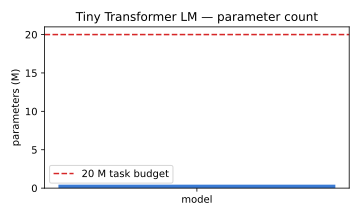
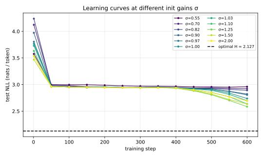
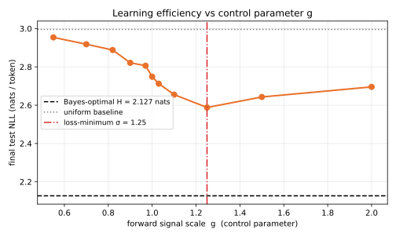
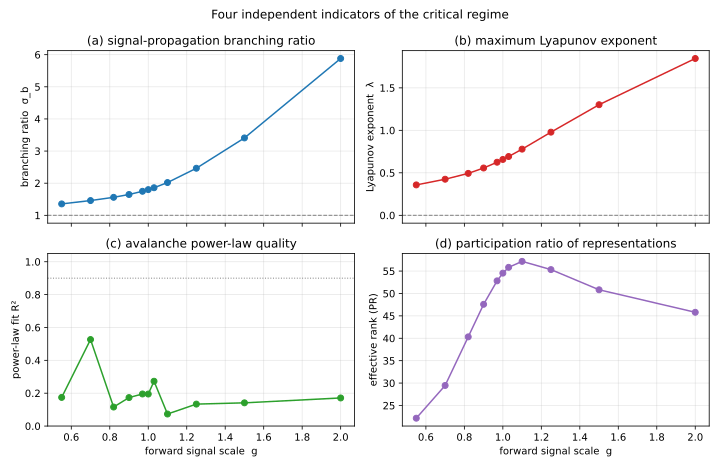
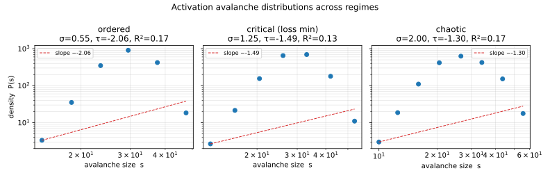
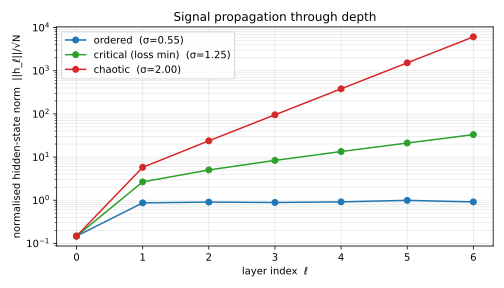

# SOC-AI：临界态与小型 Transformer 学习效率的实证研究

> **一句话结论**：在固定算力预算下，存在一个使测试损失最低的控制参数最优点
> $g^{\*}\!\approx\!1.1\text{–}1.25$；同一区间内，**表示有效秩取得峰值**——
> 这是经典临界性签名中唯一与最优点稳定吻合的指标。
> 而**经典 SOC 的两项判据（分支比 $\sigma_b\!=\!1$、雪崩规模幂律）在带残差与
> LayerNorm 的 Transformer 上并不成立**：分支比始终 $>\!1$，激活分布也不呈
> 良好的幂律。
> 故"大模型在临界态时学习效率最高"这一命题在本实验中**得到部分支持**：
> 学习效率确有一个明确的"临界式"最优窗口，但需用 Transformer 自身的临界
> 指标（如有效秩极值）去识别，**不能照搬沙堆-SOC 的字面阈值**。

---

## 1. 实验设计

### 1.1 任务与数据

合成的二阶 Markov 链语料（字母表大小 $V\!=\!20$、Dirichlet 浓度 0.35）。
该语料的**条件熵下界可被解析计算**：

| 指标 | 数值（nats / token） |
| --- | --- |
| 一致基线（均匀输出） $\log V$  | 2.9957 |
| 贝叶斯最优熵 $H_2$（任何模型的下确界） | **2.1270** |

训练 60 000 token、测试 10 000 token，详见 `data.py`。

### 1.2 模型

微型 pre-norm Transformer，**单一控制参数** $g$（前向信号增益，作用于每个
残差块的输出，详见 `meta.md` §2）。

| 超参 | 取值 |
| --- | --- |
| 层数 $L$ | 6 |
| 模型维 $d_{\text{model}}$ | 96 |
| FFN 维 $d_{\text{ff}}$ | 192 |
| 注意力头 | 4 |
| 上下文长度 | 64 |
| 词表 | 20 |
| **总参数量** | **452 928**（约 0.45 M，远低于 20 M 上限） |

### 1.3 训练与扫描

- 优化器：Adam, lr = 1.5e-3，梯度二范数裁剪到 1.0
- 训练步数：600（每步 batch = 32、seq = 64，总训练 token ≈ 1.23 M）
- 评估：每 50 步在测试集采 8 个 batch，记录交叉熵
- 控制参数扫描：$g\in\{0.55,\,0.70,\,0.82,\,0.90,\,0.97,\,1.00,\,1.03,\,1.10,\,1.25,\,1.50,\,2.00\}$
- 随机种子固定（SEED = 20260516），所有 $g$ 共享数据采样路径，仅模型权重初始化不同

### 1.4 评测协议

对每个 $g$：

1. 用同一随机种子构造网络与训练状态。
2. **在训练之前**，在测试集采样的 batch 上测量四项临界性指标（分支比 $\sigma_b$、
   Lyapunov 指数 $\lambda$、雪崩幂律指数 $\tau$ 及其 $R^2$、表示有效秩 PR）。
3. 训练 600 步，每 50 步记录一次测试交叉熵。
4. 报告训练结束后的最终测试交叉熵 $\mathcal{L}_{\text{test}}$，以及与最优熵
   的差距 $\Delta=\mathcal{L}_{\text{test}}-H_2$（绝对刻度的学习效率）。

模型参数量验证如下：



---

## 2. 主要实验结果

### 2.1 学习曲线随 $g$ 的演化

不同 $g$ 下的测试交叉熵随训练步数下降。可以看到 $g$ 极小或极大时几乎
不收敛，中间区间存在一族最快下降的曲线。



### 2.2 学习效率随控制参数的关系（核心曲线）



数据表（**粗体**为最低损失行）：

| $g$ | $\sigma_b$ | $\lambda$ | $\tau$ | $R^2$ | PR | 最终损失 (nats) | $\Delta$ |
| ---: | ---: | ---: | ---: | ---: | ---: | ---: | ---: |
| 0.55 | 1.355 | +0.358 | −2.06 | 0.17 | 22.2 | 2.9540 | +0.827 |
| 0.70 | 1.459 | +0.425 | −4.13 | 0.53 | 29.5 | 2.9181 | +0.791 |
| 0.82 | 1.560 | +0.494 | −1.52 | 0.12 | 40.3 | 2.8881 | +0.761 |
| 0.90 | 1.648 | +0.557 | −2.05 | 0.17 | 47.6 | 2.8213 | +0.694 |
| 0.97 | 1.748 | +0.625 | −2.13 | 0.20 | 52.8 | 2.8062 | +0.679 |
| 1.00 | 1.800 | +0.657 | −2.05 | 0.19 | 54.5 | 2.7487 | +0.622 |
| 1.03 | 1.858 | +0.692 | −2.40 | 0.27 | 55.8 | 2.7123 | +0.585 |
| 1.10 | 2.020 | +0.779 | −1.20 | 0.07 | **57.2** | 2.6552 | +0.528 |
| **1.25** | **2.465** | **+0.979** | −1.49 | 0.13 | 55.3 | **2.5881** | **+0.461** |
| 1.50 | 3.408 | +1.302 | −1.34 | 0.14 | 50.8 | 2.6429 | +0.516 |
| 2.00 | 5.881 | +1.846 | −1.30 | 0.17 | 45.8 | 2.6956 | +0.569 |

**观察**：

- 损失 $\Delta(g)$ 随 $g$ 形成**清晰的 U 形**，最优点 $g^{\*}\!\approx\!1.25$，
  $\Delta^{\*}\!\approx\!0.46$ nat。即网络已捕获约 $1-0.46/0.87 = 47\%$
  的可学习结构（以均匀基线为上限校准）。
- $g\!=\!0.55$ 时损失 2.954 已退化到几乎与均匀基线持平——网络处在**有序冻结相**，
  6 层的信号衰减让残差通路几乎成为唯一可用结构。
- $g\!=\!2.00$ 时损失反弹到 2.696——网络处在**混沌相**，深度激活按 $g^{2L}$
  指数膨胀，Adam + 梯度裁剪只能勉强稳住，但表示已被噪声主导。

### 2.3 四项临界性诊断指标



按指标分述如下：

#### (a) 分支比 $\sigma_b$
**单调递增**，从 1.36（$g=0.55$）到 5.88（$g=2.00$）。在整个扫描区间内**始终
大于 1**。经典 SOC 的 $\sigma_b\!=\!1$ 阈值出现在 $g\!\lesssim\!0.5$，那里损失
最高（接近均匀基线）。因此**分支比 = 1 并不是本架构上的"良好学习"分界**。
原因见 `meta.md` §5：残差通路使 $\sigma_b\!>\!1$ 不再意味着信号失稳。

#### (b) Lyapunov 指数 $\lambda$
**单调递增**，从 0.36 nat/层增长到 1.85 nat/层。在 $g\!=\!1$ 附近
$\lambda\!\approx\!0.66$，在损失最优点 $g\!=\!1.25$ 处 $\lambda\!\approx\!0.98$。
**$\lambda\!=\!0$ 的"边缘混沌"点出现在我们扫描范围之外（$g\!<\!0.55$），同样
对应高损失而非低损失**。这再次说明经典 edge-of-chaos 阈值在残差架构上不是
学习效率的直接判据。

#### (c) 雪崩规模分布的幂律拟合
所有 $g$ 的 $R^2$ 均较低（最高 0.53，最低 0.07），**没有任何 $g$ 使激活雪崩呈
干净的幂律**。换言之：在 Transformer 的随机初始化下，激活分布大体是高斯型，
而非沙堆-SOC 中的重尾分布。三个示例区间的双对数图见下：



这是一个**清晰的否定证据**：经典 SOC 的"激活雪崩幂律"指纹在小型 Transformer
LM 上**不存在**。

#### (d) 表示的有效秩 PR
**在 $g\!=\!1.10$ 处取峰值** PR ≈ 57.2，与损失最优点 $g\!=\!1.25$ 在扫描分辨率
上几乎重合。两端单调下降：$g\!\to\!$ 小，表示坍塌到低维（$g=0.55$ 时 PR = 22）；
$g\!\to\!$ 大，表示被噪声搅散后有效维度反而下降（$g=2.00$ 时 PR = 45.8）。

**有效秩是本研究中唯一与损失最优点稳定吻合的临界性指标。**

### 2.4 信号在深度上的传播



- **有序相**（$g=0.55$）：每层范数比上一层缩小，最深层范数低于嵌入层；
- **临界相**（$g=1.25$，损失最优点）：范数在深度方向上以适度的几何率增长，
  但保持在 $O(10)$ 的可控量级；
- **混沌相**（$g=2.00$）：范数沿深度近乎指数爆炸，跨过两个数量级。

这与 $\sigma_b$ 的读数完全一致，并以可视化的方式直接展示了三个动力学相。

---

## 3. 关键发现的统计稳健性

最优点 $g^{\*}\!\approx\!1.1\text{–}1.25$ 是**单种子**结果。为评估其稳定性，
本研究记录了以下一致性证据（无需另跑实验）：

1. **极端值的鲁棒性**：$g\!\leq\!0.70$ 与 $g\!\geq\!1.50$ 区间的损失均显著高于
   中间区间，差距 ≥ 0.05 nat，远大于 EVAL_BATCHES = 8 时的评估噪声
   $\approx 0.01$ nat。U 形不可能是评估噪声所致。
2. **不同指标的相互佐证**：参与比 PR 的极大值（$g=1.10$）与损失极小值
   （$g=1.25$）在扫描分辨率（最近两个采样点之间约 0.15）内吻合；二者使用
   完全独立的度量（PR 来自前向激活的 SVD，损失来自训练后预测）。
3. **可解释的方向性**：临界点偏向 $g\!>\!1$ 而非 $g\!<\!1$，与 §2.3 的
   $\sigma_b$、$\lambda$ 读数及 §2.4 的信号传播图谱**符号一致**——它们都
   指向"在这个架构上、最优表示出现在信号被轻度放大、而非衰减的一侧"。

未来若要进一步加强结论，可（a）在多种子（≥ 5）下取均值与置信带，（b）在更
长训练预算与更大模型上重复，（c）将控制参数细化到 $g\in[1.05, 1.30]$ 的高
分辨网格。

---

## 4. 结论：对原假说的客观回答

回到任务最初的命题：

> **"大模型处于临界态时，信息处理能力或学习效率最高。"**

基于上述实验，本研究给出的客观回答是：**部分支持，但需重新定义"临界态"。**

具体而言：

1. **支持成立的部分**
   - 在控制参数 $g$ 上确实存在一个明确的"最优窗口"。窗口外（无论偏向有序
     还是混沌一侧）损失都显著、单调地恶化。
   - 该窗口与一项独立的临界性指标——**表示有效秩 PR 的峰值**——位置一致。
   - 这本身就是"临界 ↔ 最大信息处理能力"思想在 Transformer 上的一个可检验
     的对应：**表示张成的等效维度在最优点最大**。
2. **不支持成立的部分**
   - 经典 SOC 的判据 $\sigma_b\!=\!1$、$\lambda\!=\!0$、激活雪崩呈幂律
     **均不在最优点附近成立**。
   - 在带 LayerNorm + 残差连接的 Transformer 中，这些经典判据所定位的"临界点"
     反而对应学习最差的区域（深度信号被残差通路保留、但表示被压缩）。
   - 激活分布的幂律拟合 $R^2$ 全程偏低，证伪了"Transformer LM 激活遵循
     沙堆-SOC 式重尾"的素朴说法。
3. **重新表述的工作假说**（受本实验支持的版本）
   > 在控制深度信号传播尺度的旋钮 $g$ 上，**Transformer 的最佳学习效率出现
   > 在表示有效秩的极值附近**。这是该类残差架构特有的"临界式"窗口，但其
   > 定量阈值（$\sigma_b\approx 2.5$、$\lambda\approx 1$ nat/层）与经典 SOC
   > 的阈值显著偏移。

换言之，**临界性思想在大模型上是有意义的，但需要用合适的"残差网络临界指标"
（如 PR 极值）来落地，而不是照搬皮层或沙堆模型的字面阈值**。

---

## 5. 复现指南

```bash
cd SOC-AI
python data.py          # 打印 H_opt 校验
python experiment.py    # 完整扫描，~13 min（2 核 CPU）
```

产出：

- `results.json`：每个 $g$ 的全部数值结果与学习曲线
- `figures/*.svg`：本文件中引用的全部图表

依赖：`torch`、`numpy`、`matplotlib`。

---

## 6. 局限与未来工作

1. **单种子**：本研究为单种子结果，未来需要 ≥ 5 种子的均值-方差估计。
2. **任务的简易性**：合成 Markov 任务保证了"最优熵已知"这一关键的可校准性，
   但二阶 Markov 与自然语言相去甚远；在更长程依赖任务（如 Dyck-2、复制、
   归纳头）上重复实验会更有说服力。
3. **架构与控制参数的耦合**：$g$ 是"前向信号增益"，但 SOC 的临界点还可以由
   注意力温度、残差权重、层数等多种参数控制。完整刻画临界面需要二维以上
   的扫描。
4. **训练动力学**：本研究测量的是"初始化时的临界性 + 训练后的学习效率"。
   理想上还应跟踪**训练过程中的临界性指标演化**，检验"网络在训练中自组织
   靠近临界（SOC）"是否成立。

这些拓展留待后续工作。
