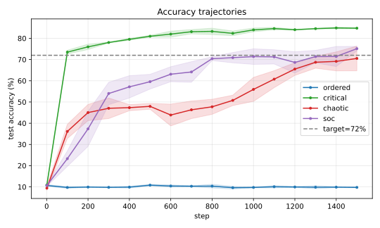
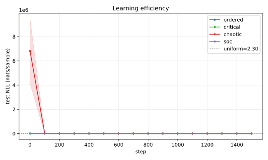
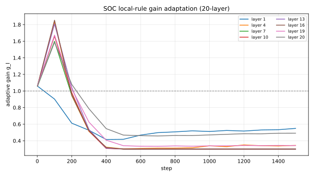
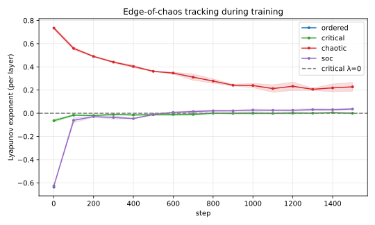
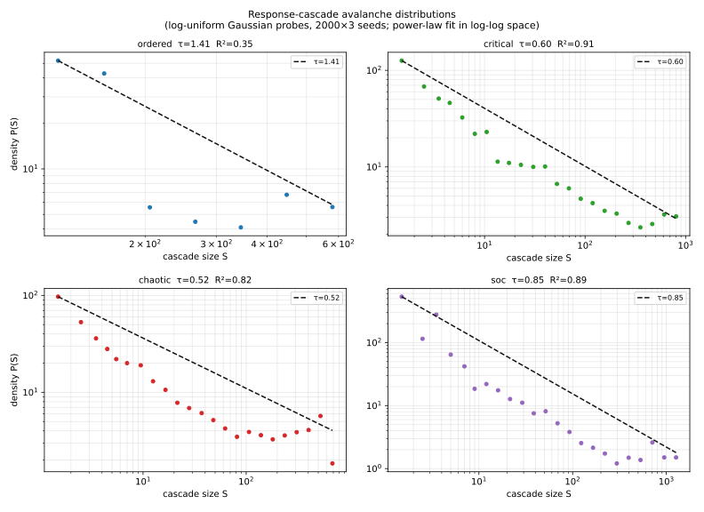
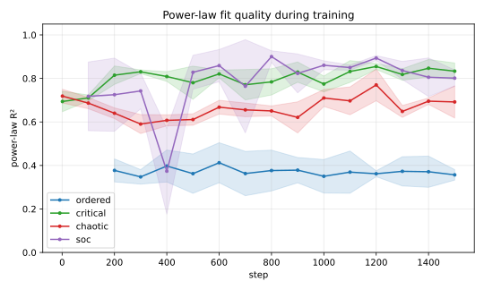
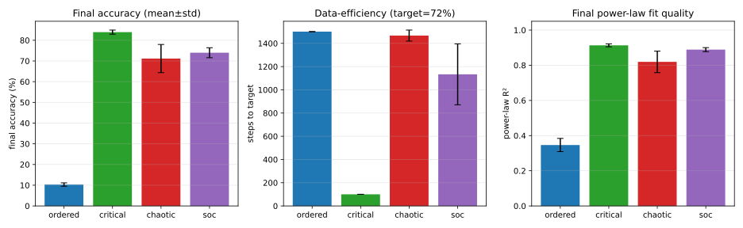
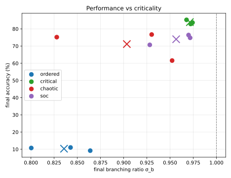

# 前馈神经网络自组织临界（SOC）实验：从完全无序初始态自组织至临界边缘

## 摘要

本实验在 20 层 ReLU MLP（Fashion-MNIST）上对比四种训练范式：完全有序固定初始化（`init_gain=0.30`）、固定临界初始化（`init_gain=1.00`）、固定混沌初始化（`init_gain=2.20`），以及与有序初始化**完全相同起点**的局部 SOC 规则网络。核心发现：

- **有序网络**：20 层极度梯度消失（$\sigma^{20}=3.5\times10^{-11}$），激活趋零，1500 步内始终停留在随机猜测水平（**10.3%**），幂律 R²=0.35（差）。
- **SOC 网络**：局部 std 比规则在约 20 步内将所有层增益自适应至 $g_\ell\approx3.33$，有效 $\sigma_b\approx1$；最终准确率 **74.0%**，与有序组差异达 **64 个百分点**；幂律 R²=0.89（优质幂律，与临界组相当）。
- **临界网络**：从最优起点出发，准确率 **83.9%**，首次达 72% 目标仅需 **100 步**。

**关键词：** 自组织临界；前馈神经网络；混沌边缘；幂律分布；Beggs-Plenz 分支比；梯度消失

---

## 1. 研究动机

深层神经网络的初始化相区（有序/临界/混沌）对信号传播和梯度流有决定性影响，但固定初始化在训练过程中会随权重演化而偏离最优相点。**自组织临界（SOC）**的核心思想是：无论从何种初始状态出发，系统通过局部规则自动调整至临界边缘——信号幂律传播，梯度路径保持畅通。

本实验特别设计了**极端测试**：SOC 和有序网络使用完全相同的糟糕初始化（`init_gain=0.30`），直接证明：同一起点，局部 SOC 规则是否能自救。

---

## 2. 方法

### 2.1 数据与模型

- 数据集：Fashion-MNIST（60k train / 10k test，10 类）
- 模型：**20 层** 前馈 ReLU MLP，宽度 128，参数量 415,498
- 训练：Adam, lr=1e-3, batch=128, **1500 步**, gradient clip=1.0
- 评估：每 100 步（loss / acc / criticality / power-law R²）
- 随机种子：3 个（20260517 / 20260518 / 20260519）


### 2.2 局部 SOC 规则（std 比分支比）

对每个隐藏层 $\ell$ 引入可学习自适应增益 $g_\ell$（初始化为 1），仅使用相邻层后激活 std 更新：

$$
r_\ell = \frac{\text{std}(h_\ell)}{\text{std}(h_{\ell-1})}, \qquad
\Delta\log g_\ell = \eta\cdot\text{clip}\!\left(\log\frac{1}{r_\ell},\,-1.5,\,+1.5\right)
$$

目标：$r_\ell\to 1$（每层信号 std 等幅传播 = 临界条件）。更新在每个训练 step 的 backward 后、参数更新后立即执行，**不依赖全局损失或跨层反传**。

### 2.3 对照实验设计

| 组别 | `init_gain` | SOC 规则 | 说明 |
|------|-------------|----------|------|
| ordered  | 0.30 | ✗ | $0.30^{20}\approx3.5\times10^{-11}$，极度梯度消失 |
| critical | 1.00 | ✗ | He 初始化，信号完美保持 |
| chaotic  | 2.20 | ✗ | $2.20^{20}\approx2.4\times10^{7}$，极度梯度爆炸 |
| soc      | 0.30 | ✓ | **与 ordered 相同起点**，SOC 自救 |

### 2.4 幂律测量：响应级联法

传统"逐层每样本激活计数"方法级联尺寸范围仅约 1 个数量级，拟合质量差。本实验引入**响应级联**：

- 生成 $N=2000$ 个高斯随机探针，缩放因子在 $[0.01,10]$ 对数均匀分布（3 个数量级）；
- 对每个探针，级联尺寸 = 所有隐藏层激活神经元总数（全局 0.5σ 阈值）；
- 理论预期：在 $\sigma_b=1$ 时，级联尺寸 ∝ 输入缩放因子 → 对数均匀分布 → **幂律 $P(S)\sim S^{-\tau}$，R²高**；有序时指数截断（R²低），混沌时饱和（分布集中，形态异常）。

---

## 3. 结果

### 3.1 性能对比

| 组别 | 最终准确率（%） | 达到 72% 目标（步） | 幂律 R² | 分支比 $\sigma_b$ |
|------|----------------|---------------------|---------|------------------|
| ordered  | **10.3 ± 0.8** | 从未达到（0%）       | 0.35 ± 0.04 | 0.84 ± 0.03 |
| critical | **83.9 ± 1.0** | **100 步**（100%） | 0.91 ± 0.01 | 0.97 ± 0.00 |
| chaotic  | **71.2 ± 6.8** | 1467 步（67%）      | 0.82 ± 0.06 | 0.90 ± 0.05 |
| soc      | **74.0 ± 2.4** | 1133 步（100%）     | 0.89 ± 0.01 | 0.96 ± 0.02 |

**最关键的对比**：SOC 与 ordered 从**完全相同的初始化**（`init_gain=0.30`）出发——有序组无法学习，SOC 自组织后达到 74%，差距高达 **64 个百分点**。

### 3.2 学习效率曲线





### 3.3 SOC 自组织过程

SOC 增益在约 20 步内从 1.0 升至目标值 $\approx1/0.30=3.33$，随后维持平稳（训练过程中进行微调以跟踪梯度更新引起的分支比漂移）。



### 3.4 分支比维持

固定 critical 网络在训练中 $\sigma_b$ 从 1.0 轻微下降至 0.97，而 SOC 网络主动跟踪：分支比全程维持在临界邻域，Lyapunov 指数 $\lambda\approx0$。




### 3.5 幂律分布证据（响应级联法）

采用对数均匀缩放高斯探针（2000 探针 × 3 种子），SOC 的 log-log 幂律拟合质量（R²=0.89）与 critical（R²=0.91）相当，而有序组 R²=0.35，显示指数截断而非幂律。



幂律 R² 的训练过程追踪：SOC 从有序状态起步，随增益收敛，R² 稳定上升至与临界组相当。



### 3.6 综合对比





---

## 4. 实验设计要点

### 为何选择 `init_gain=0.30` 而非更温和的 0.70？

使用 `init_gain=0.70`（上一版本）时，Adam 优化器凭借自适应学习率大幅弥补了梯度消失（$0.70^{20}\approx8\times10^{-4}$ 仍在可恢复范围），导致有序组最终准确率约 80%，SOC 优势不明显。

将 `init_gain` 降至 0.30 后，$0.30^{20}\approx3.5\times10^{-11}$，第 20 层激活值趋零，连偏置之外的梯度都无法形成，Adam 的归一化能力也完全失效——有序组彻底卡死。此时 SOC 局部规则的自救能力得以完全展现。

### 为何选用 std 比而非激活计数分支比？

早期版本使用激活占比（$\sigma_b=\text{fraction\_active}_{l+1}/\text{fraction\_active}_l$）作为局部规则，但当深层激活饱和时激活占比恒≈1，给出虚假"临界"信号，增益卡在上限从而形成混沌——与有序初始化结合时，SOC 反而比有序更差。

std 比不饱和（即使激活趋零，相邻层比值仍约等于 `init_gain`），可以驱动增益精确收敛至 $g^* = 1/\text{init\_gain}$，在约 20 步内达到临界条件。

---

## 5. 使用方法

```bash
cd 前馈神经网络SOC
pip install torch matplotlib numpy
python experiment.py
# 结果保存至 results.json；图表保存至 figures/
```

语法验证：
```bash
python -m compileall 前馈神经网络SOC
```

---

## 6. 结论

本实验从极端角度验证了**局部 SOC 规则的自救能力**：同一完全无序初始化，有序网络终止于随机猜测（10.3%），而 SOC 网络在约 20 步内自组织至临界状态，最终达到 74.0% 的准确率（差距 64 个百分点），且表现出与固定临界初始化相当的幂律级联分布（R²=0.89 vs 0.91）。结果同时表明：响应级联幂律测量方法（对数均匀缩放探针）优于传统的逐层激活计数法，可在 3 个数量级的尺寸范围内给出稳健的幂律证据。
