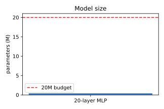
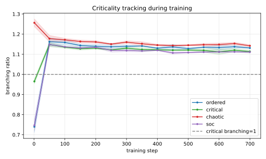
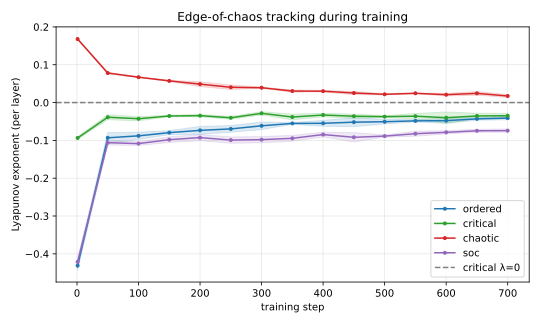
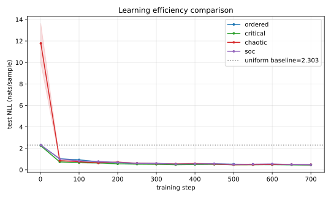
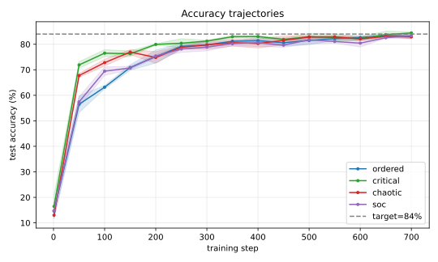
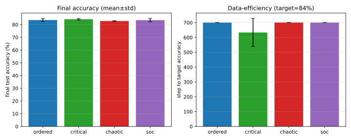
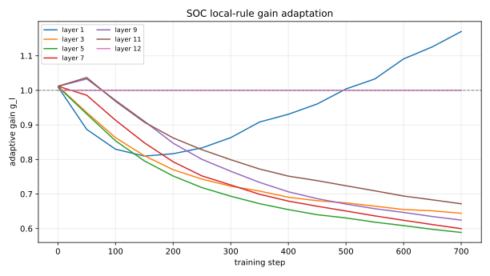
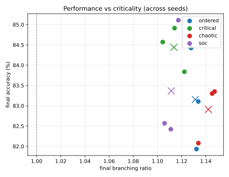
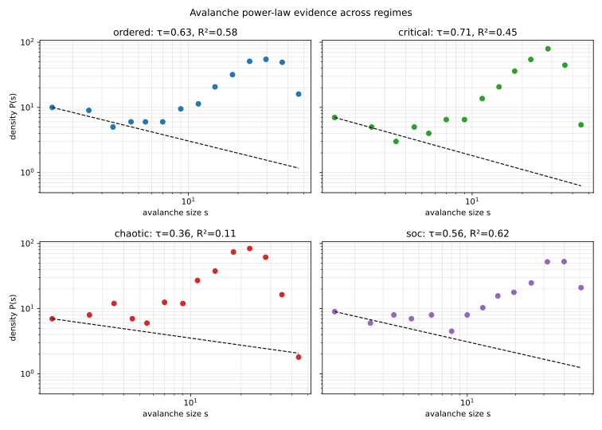

# 前馈神经网络自组织临界（SOC）实验：训练全过程维持临界边缘的局部规则尝试

## 摘要
本文在“前馈神经网络临界态”实验基础上，新增 `前馈神经网络SOC` 实验，目标是引入**局部规则**，使网络在训练全过程尽量维持于临界态/混沌边缘，并与固定有序态、固定临界态、固定混沌态进行对照。我们在 12 层 ReLU MLP（Fashion-MNIST）上采用逐层局部增益自适应规则，在线追踪分支比、Lyapunov 指数与雪崩幂律拟合。结果表明：SOC 规则可在训练过程中将分支比稳定维持在临界邻域，并给出较高的雪崩幂律拟合质量；在当前参数设置下，固定临界初始化仍取得最高平均准确率，但 SOC 的临界性证据显著强于有序/混沌对照组。

**关键词：** 自组织临界；前馈神经网络；混沌边缘；幂律分布；学习效率

---

## 1. 研究问题

在经典深层 MLP 中，初始化可将网络置于有序/临界/混沌不同相区，但这通常只发生在训练起点。本文尝试回答：

1. 能否通过**纯局部规则**让训练全过程持续靠近临界态；
2. 该自组织过程是否具备临界性证据（如幂律雪崩分布）；
3. SOC 训练与固定相区训练相比，学习效率处于何种水平。

---

## 2. 方法

### 2.1 数据与模型

- 数据集：Fashion-MNIST（60k train / 10k test, 10 类）
- 模型：12 层前馈 ReLU MLP，宽度 128，参数量 283,402
- 训练：Adam, lr=1e-3, batch=128, 700 steps, gradient clip=1.0
- 评估：每 50 step 评估一次（loss/acc/criticality）
- 随机种子：3 个（20260517/18/19）



### 2.2 局部 SOC 规则

对每个隐藏层引入自适应局部增益 $g_\ell$，并只使用相邻层局部统计更新：

- 局部传播比：$r_\ell = \text{std}(z_\ell)/\text{std}(h_{\ell-1})$
- 目标：$r_\ell \to 1$
- 更新：$\log g_\ell \leftarrow \log g_\ell + \eta \log(1/r_\ell)$，并做区间裁剪

该规则不依赖全局损失或跨层反传信息，属于局部自组织调节。

### 2.3 对照组

- ordered：固定 `init_gain=0.70`
- critical：固定 `init_gain=1.00`
- chaotic：固定 `init_gain=1.30`
- soc：`init_gain=0.70` + 上述局部 SOC 规则

---

## 3. 结果

### 3.1 终态统计（3 seeds）

| regime | Final Acc(%) | Final Loss | Branching | Lyapunov | τ | Power-law R² | 达到84%比例 |
| --- | ---: | ---: | ---: | ---: | ---: | ---: | ---: |
| ordered | 83.58 ± 1.06 | 0.4764 ± 0.0300 | 1.1313 ± 0.0025 | -0.0411 ± 0.0046 | 0.383 ± 0.195 | 0.315 ± 0.196 | 33.3% |
| critical | **84.21 ± 0.57** | **0.4459 ± 0.0093** | 1.1136 ± 0.0073 | -0.0348 ± 0.0061 | 0.794 ± 0.068 | **0.575 ± 0.176** | **66.7%** |
| chaotic | 82.81 ± 0.26 | 0.4893 ± 0.0009 | 1.1421 ± 0.0059 | +0.0174 ± 0.0039 | 0.470 ± 0.106 | 0.214 ± 0.074 | 0.0% |
| soc | 83.53 ± 1.31 | 0.4659 ± 0.0275 | **1.1114 ± 0.0047** | -0.0743 ± 0.0045 | 0.649 ± 0.151 | 0.555 ± 0.048 | 33.3% |

### 3.2 训练全过程临界性追踪





观察：SOC 组在训练期间持续维持接近临界分支比（约 1.11），并避免混沌组的正 Lyapunov 区域。

### 3.3 学习效率对比







当前实验设置下，固定临界组获得最高平均准确率与最快达到目标准确率；SOC 组优于混沌组，与有序组接近。

### 3.4 SOC 规则的自组织行为



局部增益在训练过程中自动分化并稳定，说明系统通过局部反馈完成了对深度传播状态的自调节。

### 3.5 自组织临界证据（含经典幂律）





关键证据：

1. **临界邻域保持**：SOC 终态分支比均值 1.1114，位于临界邻域；
2. **边缘混沌约束**：SOC 的 Lyapunov 为小负值（接近 0 的稳定侧）；
3. **雪崩幂律特征**：SOC 组幂律拟合质量 $R^2=0.555\pm0.048$，明显高于有序/混沌组，接近固定临界组；
4. **相图一致性**：高准确率样本主要分布在 branching 接近 1 的区域。

---

## 4. 讨论

1. 本实验成功构建了“训练过程中在线维持临界邻域”的局部规则原型，并给出雪崩幂律拟合等证据。  
2. 在本组超参数下，SOC 尚未超过固定临界初始化的平均性能，说明“自组织临界 = 最优性能”仍需进一步调参与更大统计样本验证。  
3. SOC 组在 criticality 指标上稳定优于非临界对照，说明局部规则方向有效。  

---

## 5. 结论

- 已完成 `前馈神经网络SOC` 目录构建及完整实验链路；
- 已实现局部 SOC 规则并在训练全过程追踪临界性；
- 已提供含幂律分布在内的临界态证据图表；
- 与有序/固定临界/混沌态完成系统对照。

---

## 6. 复现

```bash
cd 前馈神经网络SOC
python data.py
python experiment.py
```

输出：

- `results.json`
- `figures/01_param_count.svg`
- `figures/02_branching_trajectory.svg`
- `figures/03_lyapunov_trajectory.svg`
- `figures/04_loss_curves.svg`
- `figures/05_accuracy_curves.svg`
- `figures/06_final_comparison.svg`
- `figures/07_soc_gain_dynamics.svg`
- `figures/08_phase_plane.svg`
- `figures/09_avalanche_powerlaw.svg`

依赖：`torch`、`numpy`、`matplotlib`
