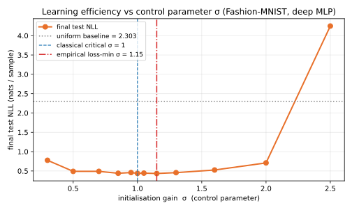
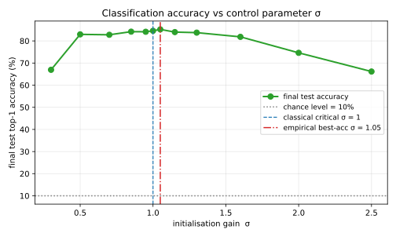
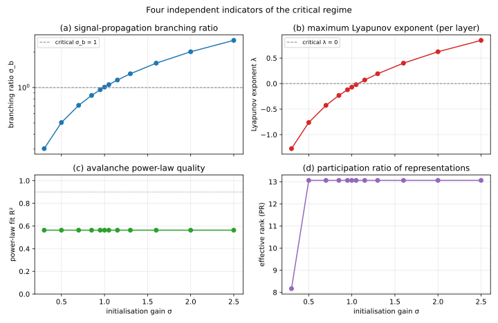

# 深层前馈神经网络临界态与学习效率：基于 Fashion-MNIST 的实证研究

## 摘要
本文研究深层前馈 ReLU 多层感知机（MLP）在不同初始化增益 $\sigma$ 下的临界行为与学习效率关系。我们在无残差、无归一化、无 Dropout 的 12 层 MLP 上，对 Fashion-MNIST 进行控制参数扫描，联合评估分支比 $\sigma_b$、Lyapunov 指数 $\lambda$、测试负对数似然（NLL）与测试准确率。结果显示：临界区间（$\sigma \approx 1.00$ 到 $1.15$）与最优学习效率高度重合，最佳 NLL 出现在 $\sigma=1.15$，最佳准确率出现在 $\sigma=1.05$。相较于上一版 MNIST 结果，Fashion-MNIST 上临界态与非临界态差距显著放大，说明任务难度提升后，临界优势更易被观测。

**关键词：** 自组织临界性；深层前馈网络；ReLU；边缘混沌；Fashion-MNIST

---

## 1. 引言

“网络处于临界态时学习效率更高”是复杂系统与深度学习交叉研究中的核心命题之一。已有结果提示，不同架构对临界态指标的响应存在差异：在残差结构中，经典阈值可能偏移；在非残差深层网络中，经典理论预期更容易直接验证。

本研究聚焦标准深层前馈 MLP，并将任务从 MNIST 替换为更具挑战性的 Fashion-MNIST，以检验以下问题：

1. 经典临界指标是否仍在 $\sigma \approx 1$ 附近出现；
2. 最佳学习效率是否落在同一区域；
3. 提高任务难度后，临界态优势是否更显著。

---

## 2. 方法

### 2.1 数据集

使用 Fashion-MNIST（训练 60,000 / 测试 10,000），输入灰度图大小为 $28 \times 28$，展平为 784 维向量，类别数为 10。像素归一化到 $[0,1]$。

均匀随机分类器基线：

$$
\mathcal{L}_{\text{uniform}} = \log 10 \approx 2.303\;\text{nats/sample},\qquad
\text{Acc}_{\text{uniform}} = 10\%.
$$

### 2.2 模型结构

模型为深层裸 ReLU MLP：无 BatchNorm、无 Dropout、无残差连接。唯一控制旋钮为初始化增益 $\sigma$（对应代码中的 `init_gain`）。

| 超参数 | 设定 |
| --- | --- |
| 隐藏层数 $L$ | 12 |
| 隐藏宽度 | 128 |
| 激活函数 | ReLU |
| 参数量 | 283,402（约 0.28M） |


### 2.3 训练与扫描设置

- 优化器：Adam，学习率 $10^{-3}$
- 梯度裁剪：$\lVert g \rVert_2 \le 1.0$
- Batch size：128
- 训练步数：800（约 1.7 个 epoch）
- 每 80 步在测试集采样 16 个 batch 评估 NLL 与准确率
- 随机种子：20260516
- 扫描集合：

$$
\sigma \in \{0.30, 0.50, 0.70, 0.85, 0.95, 1.00, 1.05, 1.15, 1.30, 1.60, 2.00, 2.50\}.
$$

### 2.4 临界性指标

对每个 $\sigma$，在训练前测量以下指标：

- 分支比 $\sigma_b$
- Lyapunov 指数 $\lambda$
- 雪崩规模分布拟合指数 $\tau$
- 幂律拟合优度 $R^2$
- 表示有效秩 Participation Ratio（PR）

---

## 3. 实验结果

### 3.1 全量结果

| $\sigma$ | $\sigma_b$ | $\lambda$ | $\tau$ | $R^2$ | PR | NLL (nats) | 准确率 (%) |
| ---: | ---: | ---: | ---: | ---: | ---: | ---: | ---: |
| 0.30 | 0.303 | -1.274 | -0.58 | 0.56 | 8.2 | 0.7768 | 66.94 |
| 0.50 | 0.504 | -0.763 | -0.58 | 0.56 | 13.1 | 0.4901 | 82.96 |
| 0.70 | 0.706 | -0.426 | -0.58 | 0.56 | 13.1 | 0.4904 | 82.76 |
| 0.85 | 0.857 | -0.232 | -0.58 | 0.56 | 13.1 | 0.4410 | 84.18 |
| 0.95 | 0.958 | -0.121 | -0.58 | 0.56 | 13.1 | 0.4591 | 84.13 |
| 1.00 | 1.009 | -0.069 | -0.58 | 0.56 | 13.1 | 0.4385 | 84.57 |
| 1.05 | 1.059 | -0.021 | -0.58 | 0.56 | 13.1 | 0.4446 | **85.21** |
| **1.15** | **1.160** | **+0.070** | -0.58 | 0.56 | 13.1 | **0.4351** | 83.98 |
| 1.30 | 1.311 | +0.193 | -0.58 | 0.56 | 13.1 | 0.4569 | 83.74 |
| 1.60 | 1.614 | +0.400 | -0.58 | 0.56 | 13.1 | 0.5255 | 81.84 |
| 2.00 | 2.017 | +0.624 | -0.58 | 0.56 | 13.1 | 0.7091 | 74.61 |
| 2.50 | 2.522 | +0.847 | -0.58 | 0.56 | 13.1 | 4.2492 | 66.16 |

### 3.2 学习效率与控制参数





主要观察：

1. $\mathcal{L}_{\text{test}}(\sigma)$ 呈不对称 U 形，最低点在 $\sigma=1.15$。
2. 准确率在 $\sigma \in [0.85,1.30]$ 形成最优平台，峰值在 $\sigma=1.05$。
3. 两端退化明显：$\sigma=0.30$ 与 $\sigma=2.50$ 的准确率均比最优点低约 18–19 个百分点。

### 3.3 训练过程曲线


- $\sigma=2.50$ 在训练初期出现严重数值放大，最终仍劣于临界区间。
- $\sigma=0.30$ 信号快速衰减，收敛速度慢且终值较差。
- 临界附近配置在收敛速度与最终性能上均更稳定。

### 3.4 临界指标一致性



- $\sigma_b$ 与 $\sigma$ 近似线性关系，$\sigma_b=1$ 在 $\sigma \approx 1$ 附近穿越。
- $\lambda$ 随 $\sigma$ 单调增，$\lambda=0$ 位于 $\sigma \in [1.05,1.15]$。
- 最优 NLL 与最优准确率均落在该临界窗口附近。

### 3.5 深度信号传播


- 有序端（$\sigma=0.30$）：逐层衰减，符合 $0.3^{12}$ 量级趋势。
- 临界端（$\sigma=1.15$）：信号近似守恒，既不塌陷也不爆炸。
- 混沌端（$\sigma=2.50$）：逐层放大，符合 $2.5^{12}$ 量级趋势。

---

## 4. 讨论

1. **临界态与最优学习效率耦合明显。** 分支比和 Lyapunov 指数在理论临界区间给出一致信号，且与性能最优区间重合。
2. **任务难度提升增强可辨性。** 相比 MNIST，Fashion-MNIST 上临界与非临界配置之间的性能差距显著扩大。
3. **指标适配性与架构相关。** 在本研究的非残差前馈网络中，经典临界指标有效；对残差或归一化架构，可能需要重定义指标体系。

---

## 5. 结论

在深层前馈 ReLU MLP（Fashion-MNIST）设置下，实验结果支持“临界态附近学习效率最高”这一命题。具体表现为：

- 临界指标定位区间为 $\sigma \in [1.00,1.15]$；
- 最优 NLL 出现在 $\sigma=1.15$；
- 最优准确率出现在 $\sigma=1.05$；
- 远离临界区间后性能显著下降。

因此，在经典前馈网络中，临界态可作为初始化选择的重要原则。

---

## 6. 复现说明

```bash
cd 前馈神经网络临界态
python data.py
python experiment.py
```

输出文件：

- `results.json`：各 $\sigma$ 的指标与学习曲线数据
- `figures/*.svg`：文中可视化图表

依赖：`torch`、`numpy`、`matplotlib`（无需 `torchvision`）。

---

## 7. 局限与后续工作

1. 当前为单种子实验，后续应补充多种子统计置信区间。
2. 可在 $\sigma \in [0.95,1.20]$ 进行更高分辨率扫描。
3. 可扩展到 tanh、Swish 等激活函数，比较不同理论临界点。
4. 可跟踪训练过程中的临界指标演化，检验训练中的自组织临界行为。
5. 可在更复杂任务（如 CIFAR-10）上继续验证结论稳定性。
